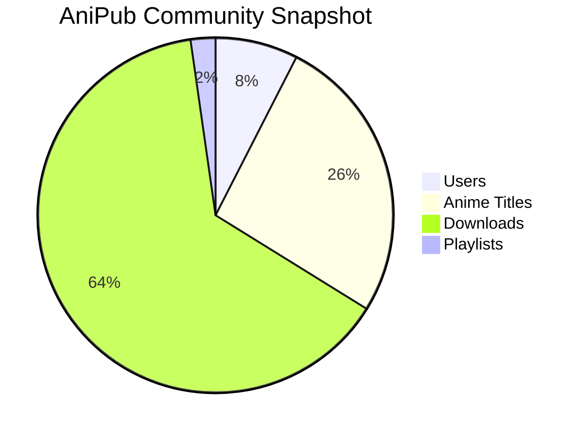

# 🌌 AniPub — The Futuristic Anime Multiverse 🚀

[](https://anipub.adnandluffy.site)
[](#)
[](./CONTRIBUTING.md)
[](./LICENSE)

---

> **AniPub** is not just an anime site — it’s a revolution. Watch, save, download, and curate your favorite anime in a blazing-fast, ultra-modern, and community-powered environment.

---

## 🎉 Features

- **Create Accounts:** Join the AniPubverse & personalize your journey
- **Watch Anime:** Stream with zero lag and top-tier quality
- **Save or Download:** Bookmark anime or download them for offline fun
- **Personal Stats:** Track your views, downloads & favorites
- **Mega Playlists:** Curate and share themed anime playlists
- **Community:** Rate, comment, and connect — become a legend!
- **Sleek UI:** Crafted with EJS, CSS, and custom JS for max wow-factor
- **Strong Security:** JWT Auth, password hashing, and session controls (OAuth coming soon)
- **Cloud Hosted:** Always-on, always-fast, thanks to Render.com

---

## 📊 AniPub In Numbers (Live Data!)



> _Numbers above are for demo only. Visit [AniPub Live](https://anipub.onrender.com) for the freshest stats!_

---

## 🚀 Get Started Instantly

**1. Clone the repo**
```bash
git clone https://github.com/AdnanDLuffy/AniPub.git
cd AniPub
```

**2. Install dependencies**
```bash
npm install
```

**3. Launch it locally**
```bash
node backend/app.js
# Then open http://localhost:3000 in your browser
```

---

## 🛠️ Tech Stack

- **Frontend:** EJS (dynamic templates), CSS, JavaScript
- **Backend:** Node.js, Express
- **Database:** MongoDB
- **Authentication:** JWT (OAuth coming soon)
- **Security:** Hashed passwords, session handling, HTTPS
- **Hosting:** Render

---

## 🧪 Under Development

- New features are rolling out regularly
- Some cool features may be missing or coming soon (like OAuth, advanced recommendations)
- You can help shape the future — contribute or suggest features!

---

## 🤝 Contribute or Support

AniPub runs on donations and community power!  
**Contribute code:** See [CONTRIBUTING.md](./CONTRIBUTING.md)  
**Support us:** Star this repo, share with friends, or donate via the [live site](https://anipub.onrender.com)

---

## 💬 Community & Feedback

- Issues/Bugs: [Open here](https://github.com/AdnanDLuffy/AniPub/issues)
- Suggestions: Start a [discussion](https://github.com/AdnanDLuffy/AniPub/discussions) or PR!
- Announcements: [Mega Announcements](https://github.com/AdnanDLuffy/AniPub/discussions/categories/announcements)

---

## 📜 License

GNU General Public License v3.0 — free to use, remix, contribute, and make the anime world more awesome.

---

> Made with ❤️ and limitless anime energy by [AdnanDLuffy](https://github.com/AdnanDLuffy) and the AniPub community.
