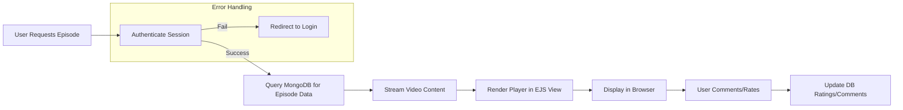

# AniPub: The Ultimate Anime Multiverse

 

[](https://github.com/AnimePub/AniPub/stargazers)
[](https://github.com/AnimePub/AniPub/network/members)
[](https://github.com/AnimePub/AniPub/watchers)
[](https://github.com/AnimePub/AniPub/blob/main/LICENSE)
[](https://anipub.xyz)

Welcome to **AniPub**, the modern, ad-free, and privacy-first anime streaming platform built for true otakus. Dive into a vast multiverse of anime without distractions, trackers, or interruptions. Powered by a passionate community, AniPub combines blazing-fast performance, intuitive design, and innovative features like AI assistance to redefine how you watch, discover, and connect over anime.

Whether you're binge-watching classics like *One Piece* or exploring hidden gems, AniPub is your gateway to an endless anime adventure. Open-source, extensible, and community-driven—join us in shaping the future of anime streaming!

## Table of Contents
- [Features](#features)
- [Why AniPub?](#why-anipub)
- [Tech Stack](#tech-stack)
- [Architecture Overview](#architecture-overview)
- [Installation](#installation)
- [Usage](#usage)
- [Contributing](#contributing)
- [Roadmap](#roadmap)
- [Community & Support](#community--support)
- [Security & Privacy](#security--privacy)
- [License](#license)

## Features
AniPub is packed with features designed to enhance your anime experience:

- **Ad-Free Streaming**: Enjoy uninterrupted viewing—no pop-ups, banners, or sponsored content.
- **Privacy-Focused**: No user tracking, data mining, or third-party analytics. Your watch history stays yours.
- **Blazing-Fast Performance**: Optimized for speed with cloud hosting, responsive design, and efficient data loading.
- **AniPub AI · Zero Two**: Your personal AI companion for recommendations, trivia, and chat-based interactions. Ask about plot summaries, character details, or even fan theories!
- **Save & Bookmark**: Create watchlists, save episodes, and pick up right where you left off.
- **Playlists & Sharing**: Curate custom playlists and share them with friends or the community.
- **Community Comments**: Discuss episodes, theories, and fan art in real-time threaded comments.
- **Ratings System**: Rate anime and see community averages to discover top-rated shows.
- **Download Support** (Coming Soon): Offline viewing for your favorite episodes.
- **Multi-Device Sync**: Seamless experience across desktop, mobile, and tablets.
- **Search & Discovery**: Advanced search with filters for genres, release years, and popularity.

## Why AniPub?
In a world flooded with ad-riddled streaming sites, AniPub stands out as a beacon for anime lovers. Born from frustration with bloated platforms, it's crafted with:
- **Community at Heart**: Open-source contributions drive innovation.
- **Simplicity & Elegance**: Clean UI inspired by modern web design principles.
- **Accessibility**: Free forever, with no paywalls or subscriptions.
- **Innovation**: Integrating AI for smarter, more engaging interactions.

If you're tired of endless ads and privacy invasions, AniPub is your escape pod to pure anime bliss.

## Tech Stack
AniPub leverages a robust, modern stack for reliability and scalability:

| Layer       | Technologies                  | Purpose                          |
|-------------|-------------------------------|----------------------------------|
| **Frontend** | EJS, CSS, JavaScript         | Server-rendered templates for dynamic UI, custom styling, and interactive elements. |
| **Backend**  | Node.js, Express             | Handles API requests, routing, and server logic. |
| **Database** | MongoDB                      | Stores user data, anime metadata, ratings, comments, and playlists. |
| **Auth**     | JWT, Google OAuth            | Secure authentication and session management. |
| **Security** | Hashed Passwords, HTTPS      | Protects user data and ensures secure connections. |
| **Assets**   | Custom Images & Thumbnails   | Enhances visual appeal with anime-specific media. |

## Architecture Overview
AniPub follows a full-stack MVC (Model-View-Controller) architecture, ensuring separation of concerns for maintainability. Here's how it all ties together:

### High-Level System Model
The application flows from user requests through the backend to the database, rendering views dynamically.

```mermaid
graph TD
    A[User Browser] -->|HTTP Request| B[Express Server (Node.js)]
    B -->|Auth Check| C[JWT / Google OAuth]
    C -->|Validated| D[MongoDB Database]
    D -->|Data Fetch| B
    B -->|Render| E[EJS Templates]
    E -->|HTML/CSS/JS| A
    F[AniPub AI Module] -->|API Calls| B
    subgraph "Frontend"
        A
        E
    end
    subgraph "Backend"
        B
        C
        F
    end
    subgraph "Data Layer"
        D
    end
```

- **User Browser**: Interacts with the UI, sending requests for streaming, searches, or comments.
- **Express Server**: Acts as the controller, processing requests and orchestrating responses.
- **Auth Layer**: Validates users via JWT tokens or OAuth, preventing unauthorized access.
- **MongoDB**: Models data like anime entries (e.g., title, episodes, ratings) and user profiles.
- **EJS Templates**: Views that dynamically generate HTML based on data from the backend.
- **AniPub AI**: An integrated module (likely using external AI APIs) for conversational features.

### Data Flow Model
For a typical user action, like watching an episode:


```mermaid
flowchart LR
    Start[User Requests Episode] --> Auth[Authenticate Session]
    Auth -->|Success| Fetch[Query MongoDB for Episode Data]
    Fetch --> Stream[Stream Video Content]
    Stream --> Render[Render Player in EJS View]
    Render --> Display[Display in Browser]
    subgraph "Error Handling"
        Auth -->|Fail| Redirect[Redirect to Login]
    end
    Display --> Interact[User Comments/Rates]
    Interact --> Update[Update DB Ratings/Comments]
```

This model ensures efficient, secure data handling with real-time updates.

### Security Model
AniPub prioritizes security through layered protections:

```mermaid
graph LR
    A[External Request] -->|HTTPS| B[Firewall / Rate Limiting]
    B --> C[Input Validation]
    C --> D[Authentication (JWT/OAuth)]
    D --> E[Authorization Checks]
    E --> F[Data Access (MongoDB)]
    F -->|Encrypted| G[Response]
    subgraph "Security Layers"
        B
        C
        D
        E
    end
```

Passwords are hashed (e.g., using bcrypt), sessions are secure, and all communications are encrypted.

## Installation
Get AniPub running locally in minutes!

### Prerequisites
- Node.js (v14+)
- MongoDB (local or cloud instance)
- Git

### Steps
1. Clone the repository:
   ```bash
   git clone https://github.com/AnimePub/AniPub.git
   cd AniPub
   ```
2. Install dependencies:
   ```bash
   npm install
   ```
3. Set up environment variables (copy `.env.example` to `.env` and fill in details like MongoDB URI).
4. Start the server:
   ```bash
   node backend/app.js
   ```
5. Open your browser: http://localhost:3000

For quick setups:
- **Linux**: Run `curl -sL https://github.com/AnimePub/install-scripts/raw/main/install.sh | bash` (review script first!).
- **Arch Linux**: Use the dedicated `arch.sh` script.

**Note**: For testing, use default credentials (email: aabdullahal466@gmail.com, password: 12345678). In production, secure your setup!

## Usage
- **Browsing Anime**: Search or browse the catalog on the homepage.
- **Streaming**: Click an episode to start watching—seamless and buffer-free.
- **AI Chat**: Interact with Zero Two for personalized recommendations.
- **Community Features**: Log in to comment, rate, and create playlists.
- **Admin Tools**: (If applicable) Manage content via backend routes.

Example API Endpoint (for developers): `/api/anime/search?q=onepiece` – Returns JSON results.

## Contributing
We love contributions! Whether it's bug fixes, new features, or UI tweaks:
- Check `CONTRIBUTING.md` for guidelines.
- Fork the repo, create a branch, and submit a Pull Request.
- Report issues or suggest ideas in Discussions.

All contributions must adhere to our Code of Conduct (`CODE_OF_CONDUCT.md`).

## Roadmap
- **Short-Term**: Enhanced search filters, mobile app integration.
- **Medium-Term**: Full download support, recommendation engine using ML.
- **Long-Term**: Expanded AI capabilities, multi-language support, VR streaming.

Track progress in Issues and Discussions.

## Community & Support
- **Discussions**: Share ideas, ask questions, or join announcements.
- **Discord**: Join our server for real-time chats (link above).
- **Star & Share**: Help us grow by starring the repo and spreading the word!

For security issues, see `SECURITY.md`.

## Security & Privacy
AniPub is built with security in mind:
- **No Tracking**: Zero cookies for analytics.
- **Data Protection**: All user data is encrypted and minimal.
- **Open Audits**: As open-source, anyone can review the code.

We comply with GPL-3.0 and encourage responsible use.

## License
AniPub is licensed under the [GNU General Public License v3.0](LICENSE). Feel free to use, modify, and distribute—just keep it open-source!
