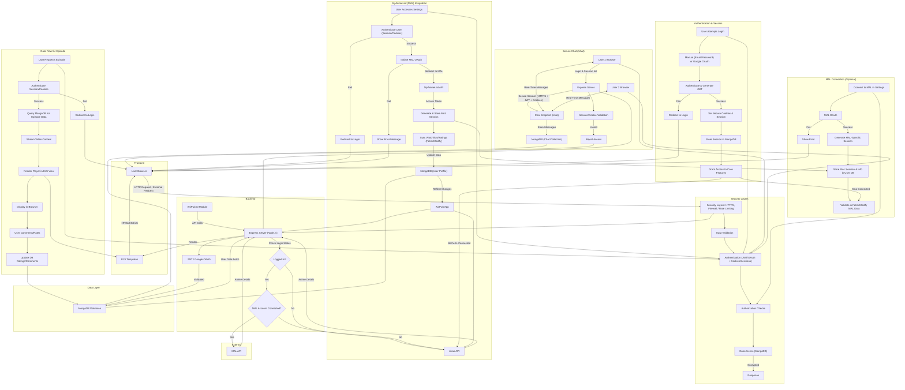

```mermaid
flowchart TD
    %% Overall Structure
    StartUser["User Browser"] -->|HTTP Request / External Request| SecurityEntry["Security Layers: HTTPS, Firewall / Rate Limiting"]
    
    %% Security Model Integration
    subgraph "Security Layers"
        SecurityEntry --> InputVal["Input Validation"]
        InputVal --> AuthCheck["Authentication (JWT/OAuth + Cookies/Sessions)"]
        AuthCheck --> AuthZ["Authorization Checks"]
        AuthZ --> DataAccess["Data Access (MongoDB)"]
        DataAccess -->|Encrypted| Response["Response"]
    end
    
    %% High-Level System Model Integration
    SecurityEntry --> Express["Express Server (Node.js)"]
    Express --> Auth["JWT / Google OAuth"]
    Auth -->|Validated| MongoDB["MongoDB Database"]
    MongoDB -->|User Data Fetch| Express
    Express -->|Check Login Status| DEC1{Logged In?}
    DEC1 -->|No| JIKAN["Jikan API"]
    DEC1 -->|Yes| DEC2{MAL Account Connected?}
    DEC2 -->|Yes| MAL["MAL API"]
    DEC2 -->|No| JIKAN
    JIKAN -->|Anime Details| Express
    MAL -->|Anime Details| Express
    Express -->|Render| EJS["EJS Templates"]
    EJS -->|HTML/CSS/JS| StartUser
    AniPubAI["AniPub AI Module"] -->|API Calls| Express
    
    %% Authentication & Session Model Integration
    subgraph "Authentication & Session"
        UserLogin["User Attempts Login"] --> Method["Manual (Email/Password) or Google OAuth"]
        Method --> AuthGen["Authenticate & Generate JWT"]
        AuthGen -->|Success| SessionSet["Set Secure Cookies & Session"]
        SessionSet --> DBStore["Store Session in MongoDB"]
        DBStore --> AppAccess["Grant Access to Core Features"]
        AuthGen -->|Fail| RedirectLogin["Redirect to Login"]
    end
    UserLogin --> AuthCheck
    
    %% MAL Connection Subgraph
    subgraph "MAL Connection (Optional)"
        ConnectMAL["Connect to MAL in Settings"] --> MALOAuth["MAL OAuth"]
        MALOAuth -->|Success| MALSessionGen["Generate MAL-Specific Session"]
        MALSessionGen --> MALDBStore["Store MAL Session & Info in User DB"]
        MALDBStore --> MALSync["Validate & Fetch/Modify MAL Data"]
        MALOAuth -->|Fail| MALError["Show Error"]
    end
    AppAccess -->|MAL Connected| MALSync
    AppAccess -->|Not MAL Connected| JIKAN
    ConnectMAL --> AuthZ
    
    %% Data Flow Model Integration
    subgraph "Data Flow for Episode"
        EpisodeReq["User Requests Episode"] --> EpisodeAuth["Authenticate Session/Cookies"]
        EpisodeAuth -->|Success| EpisodeFetch["Query MongoDB for Episode Data"]
        EpisodeFetch --> StreamVideo["Stream Video Content"]
        StreamVideo --> RenderPlayer["Render Player in EJS View"]
        RenderPlayer --> DisplayBrowser["Display in Browser"]
        EpisodeAuth -->|Fail| EpisodeRedirect["Redirect to Login"]
        DisplayBrowser --> UserInteract["User Comments/Rates"]
        UserInteract --> UpdateDB["Update DB Ratings/Comments"]
    end
    EpisodeReq --> AuthCheck
    UpdateDB --> MongoDB
    RenderPlayer --> EJS
    
    %% Secure Chat Model Integration
    subgraph "Secure Chat (/chat)"
        User1["User 1 Browser"] -->|Login & Session Init| ChatExpress["Express Server"]
        ChatExpress -->|"Secure Session (HTTPS + JWT + Cookies)"| ChatEndpoint["Chat Endpoint (/chat)"]
        ChatEndpoint -->|Store Messages| ChatDB["MongoDB (Chat Collection)"]
        User1 <-->|Real-Time Messages| ChatEndpoint
        User2["User 2 Browser"] <-->|Real-Time Messages| ChatEndpoint
        ChatExpress --> SessionVal["Session/Cookie Validation"]
        SessionVal -->|Invalid| RejectAccess["Reject Access"]
    end
    User1 --> AuthCheck
    User2 --> AuthCheck
    ChatExpress --- Express
    ChatDB --- MongoDB
    
    %% MAL Integration Model (already partially integrated, but full flow)
    subgraph "MyAnimeList (MAL) Integration"
        SettingsAccess["User Accesses Settings"] --> SettingsAuth["Authenticate User (Session/Cookies)"]
        SettingsAuth -->|Success| InitiateConnect["Initiate MAL OAuth"]
        InitiateConnect -->|Redirect to MAL| MALAPI["MyAnimeList API"]
        MALAPI -->|Access Token| GenMALSession["Generate & Store MAL Session"]
        GenMALSession --> DataSync["Sync Watchlists/Ratings (Fetch/Modify)"]
        DataSync -->|Update Data| ProfileDB["MongoDB (User Profile)"]
        ProfileDB -->|Reflect Changes| AniPubApp["AniPub App"]
        SettingsAuth -->|Fail| SettingsRedirect["Redirect to Login"]
        InitiateConnect -->|Fail| ConnectError["Show Error Message"]
        AniPubApp --> JIKAN
    end
    SettingsAccess --> AuthCheck
    GenMALSession --> MALDBStore
    ProfileDB --- MongoDB
    AniPubApp --- Express
    
    %% Subgraphs for Layers
    subgraph "Frontend"
        StartUser
        User1
        User2
        EJS
    end
    subgraph "Backend"
        Express
        Auth
        AniPubAI
        DEC1
        DEC2
        ChatEndpoint
    end
    subgraph "Data Layer"
        MongoDB
        ChatDB
        ProfileDB
    end
    subgraph "External"
        JIKAN
        MAL
        MALAPI
    end
    
    %% Error Handling Connections
    RedirectLogin --> StartUser
    EpisodeRedirect --> StartUser
    SettingsRedirect --> StartUser
    MALError --> StartUser
    ConnectError --> StartUser
    RejectAccess --> StartUser
```
